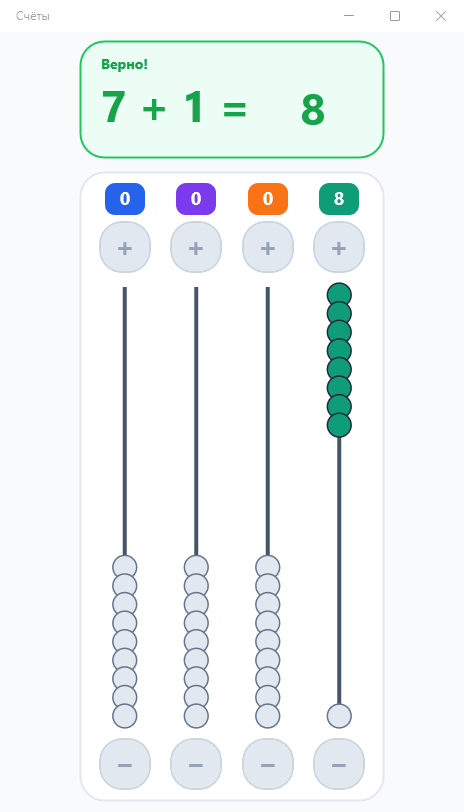

# Abacus Kids Calculator

Обучающее приложение для детей 4–9 лет: сложение и вычитание через визуальные счёты. Ребёнок меняет число кнопками `+` и `−` отдельно для единиц, десятков, сотен и тысяч.



## Текущее поведение

- Примеры `a + b` и `a − b` создаются автоматически.
- Сложение не выходит за текущий предел, вычитание всегда даёт неотрицательный результат.
- Новый пример начинается со значения левого операнда.
- Совпавший с ответом результат проверяется автоматически после двух секунд без движения бусин.
- После верного ответа следующий пример появляется автоматически через 2,8 секунды.
- После трёх верных ответов подряд предел примеров повышается с 10 до 20.
- Звуки перемещения бусин и верного ответа работают на Android и Windows.

На главном экране пока нет кнопок «Проверить», «Сброс» и «Новый», а также ручного выбора уровня. Неверное значение не отправляется на проверку автоматически, поэтому предусмотренные в Core подсказка и понижение уровня сейчас недоступны из UI. Варианты исправления описаны в [отчёте по проекту](./PROJECT_ANALYSIS.md).

## Поддерживаемые платформы

- Android 8.0 (API 26) и новее;
- Windows 10 версии 1809 (build 17763) и новее.

В основном проекте не включены целевые фреймворки iOS и macOS. Одноимённые платформенные каталоги являются шаблонными заготовками и не означают поддержку этих систем.

## Технологии и структура

- .NET 10 и .NET MAUI;
- MVVM и dependency injection;
- `GraphicsView` и собственный `IDrawable` для счётов;
- `src/KidAbacusCalculator.Core` — модели, генератор задач и ViewModel;
- `src/KidAbacusCalculator` — MAUI UI, отрисовка и платформенный звук;
- `tests/KidAbacusCalculator.Tests` — консольный тестовый запускатель;
- `PRD.md` — актуальные требования и статус реализации.

CLI и HTTP API у приложения нет.

## Требования к среде

- SDK .NET 10;
- для Windows — workload `maui-windows`;
- для Android — workload `maui-android` и JDK 17.

Установка нужного workload:

```powershell
dotnet workload install maui-windows
# Для Android вместо или вместе с Windows:
dotnet workload install maui-android
```

## Запуск для разработки

Из корня проекта на Windows:

```powershell
dotnet run --project src/KidAbacusCalculator/KidAbacusCalculator.csproj -f net10.0-windows10.0.19041.0
```

Для Android приложение запускается через выбранное устройство или эмулятор средствами .NET MAUI.

## Тесты

Тесты реализованы как консольное приложение, а не как VSTest-проект. Поэтому используется `dotnet run`; команда `dotnet test` не запускает эти проверки.

```powershell
dotnet run --project tests/KidAbacusCalculator.Tests/KidAbacusCalculator.Tests.csproj -c Release
```

## Локальная публикация Windows

Собирать на Windows. Порядок restore важен: RID-specific restore MAUI-проекта меняет assets Core, поэтому Core восстанавливается повторно перед публикацией.

```powershell
# Подготовить assets только для Windows и win-x64.
dotnet restore src/KidAbacusCalculator/KidAbacusCalculator.csproj -p:TargetFrameworks=net10.0-windows10.0.19041.0 -p:RuntimeIdentifiers=win-x64
# Вернуть Core к его фактическому TFM net10.0.
dotnet restore src/KidAbacusCalculator.Core/KidAbacusCalculator.Core.csproj --force
# PublishReadyToRun отключён, потому что restore не загружает crossgen-пакет.
dotnet publish src/KidAbacusCalculator/KidAbacusCalculator.csproj -f net10.0-windows10.0.19041.0 -c Release -r win-x64 --self-contained true --no-restore -p:TargetFrameworks=net10.0-windows10.0.19041.0 -p:WindowsPackageType=None -p:PublishReadyToRun=false -o artifacts/windows-win-x64
```

Для переноса нужно копировать всю папку `artifacts/windows-win-x64`; запускной файл — `KidAbacusCalculator.exe`.

## Android и релизы

Подписанный Android APK требует ключа. Эталонная последовательность restore, publish и параметров подписи находится в `.github/workflows/release.yml`. CI создаёт временный ключ только для тестовой установки; он не подходит для публикации в магазине.

Тег вида `v1.0.0` запускает release workflow и создаёт:

- self-contained архив Windows `win-x64`;
- подписанный временным CI-ключом Android APK.

Обычный CI собирает Core, запускает тестовый executable и проверяет Windows-сборку. Android-сборка сейчас выполняется только при релизе.
